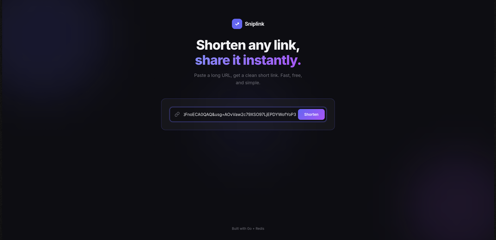
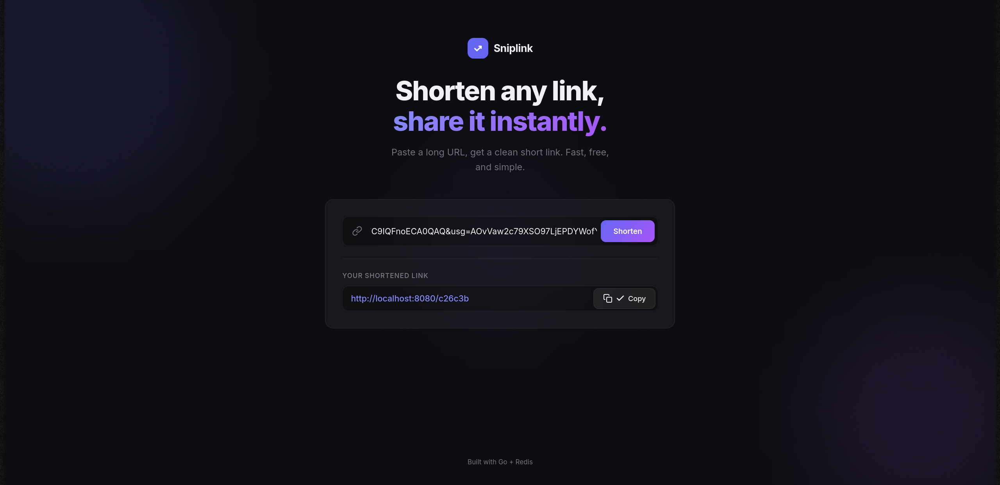

# What is URL-Shortener
URL Shortener allows users to input a long URL and receive a shortened version of it.

# Set-up 

clone the repo 

Run using Docker :

```bash
docker-compose up
```

### OR 

Start Redis:

```bash
docker run -d -p 6379:6379 --name redis redis
```

install go dep 

```bash
go mod tidy
```

run the server 

```bash
go run main.go
```

```bash
Server starts on http://localhost:8080
```

## Teck used :

- Go 
- Redis
- Docker 
- HTML, CSS, JS (This part was vibecoded)

## How it work : 

- The Main concept is taking some long URL like http://{domainName}/{LongURL} and make it http://localhost:8080/{shortURL}
-  the request come with the longURL so i take this request and use fnv-1a hash for the longURL and it output somelong numbers too so i take the first 6 characters of the hex hash
- on redis i store the URL like this 
originalURL : ShortURL, 
ShortURL : OriginalURL 
for the mapping between the two of them so when i click the short URL it redirect to the longURL using this mapping on the handler 


### API endpoints 

1- POST /shorten : Create the shortURL 

on the body json write 

```json
{
    "url": "" // here write the longURL bet ""
}
```

Response 

```json
{
  "short_url": "http://localhost:8080/{SomeNumbers}"
}
```

2- GET /{hash} : redirect to original URL


### Project Structure
```
url-shortener/
├── handlers/
│   └── handlers.go      # HTTP handlers (ShortenURL, RedirectURL)
├── models/
│   └── url.go           # Request/Response structs
├── router/
│   └── router.go        # Route registration + server start
├── storage/
│   └── redis-store.go   # Redis connection, SaveURL, GetOriginalURL
├── go.mod
└── main.go
```

## AI Usage :

Frontend is completely vibe coded using opencode zen free models MiMo v2.5 high 

it also modified the router/router.go to connect the front-end 

this part is vibecoded
```GO

	http.HandleFunc("/app/", func(w http.ResponseWriter, r *http.Request) {
		http.ServeFile(w, r, "frontend/index.html")
	})

	http.HandleFunc("/app", func(w http.ResponseWriter, r *http.Request) {
		http.Redirect(w, r, "/app/", http.StatusTemporaryRedirect)
	})

```

# Photos

## write any longURL



## The result 

